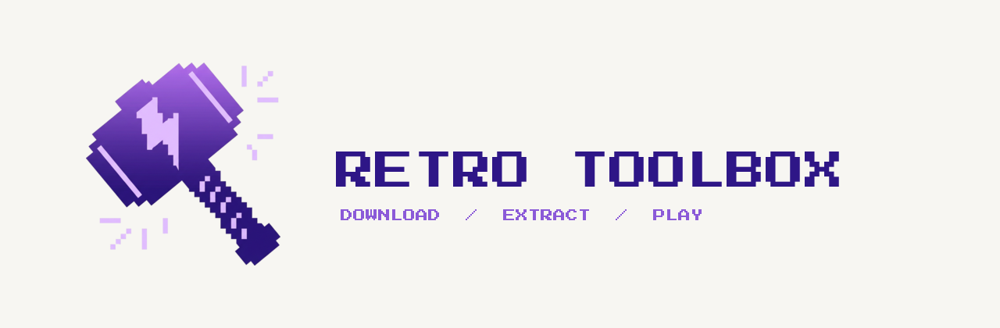

# Retro Toolbox

<div align="center">
  
  <p><a href="https://hiitsgabe.github.io/retro_toolbox/"><strong>Visit the website</strong></a></p>
</div>

<br>

> **Disclaimer:** This application does not endorse piracy. Only download files you legally own.

A cross-platform app for browsing and downloading game collections from any HTTP or HTTPS file index. Parallel downloads, automatic extraction, NSZ decompression, box art and favorites, with Android as the primary target.

---

## Features

### Download Management
- **Parallel Downloads:** Queue multiple downloads at once with configurable concurrency and real-time progress
- **Background Service:** Downloads keep running when the app is backgrounded (foreground service on Android)
- **Auto-Extraction:** ZIP archives extracted automatically after download, optionally into per-game subfolders
- **NSZ Decompression:** Decompress Nintendo Switch NSZ archives with a bundled Python runtime, no external tools needed

### Browsing & Search
- **Grid & List Views:** Switch between a grid layout with box art or a compact list view
- **Search:** Filter games by name in real time
- **Region Filtering:** Region filter with configurable regex per system
- **In-Library Detection:** See which titles you already have downloaded
- **Favorites:** Mark games as favorites, filter by them, export and import your list

### System Management
- **Custom Catalogs:** Bring your own JSON catalog or load one from a URL in-app. No catalog is bundled
- **Per-Console Settings:** Override download directory, extraction behavior, and more per system
- **Multiple Source Types:** HTML directory listings, JSON APIs, Internet Archive metadata API
- **Authentication:** Bearer tokens, cookie-based tokens, interactive sign-in flows, and IA S3 credentials

### Tools & Servers
Opened from the home screen's grid menu, grouped into **Servers** and **Tools**.

**Servers:**
- **Tinfoil Server:** Serve your Switch catalog to Tinfoil over the LAN. The app streams from the source and injects auth, so games install straight to the console
- **JDKV Server:** An embedded WebDAV server that syncs emulator save exports with JKSV on a Switch, both directions. The current save is backed up before any replace, and pulls back to the device are confirmed per game
- **SMB Share:** Connect to SMB/CIFS network shares to browse and pull files
- **FTP:** An FTP client to transfer files, plus a built-in FTP server to serve files over the LAN

**Tools:**
- **Steam Shortcut Creator:** Search the Steam store and write `.steam` shortcut files into any folder
- **NSZ Decompress:** Standalone NSZ to NSP decompression. Pick a file and an output folder (prompts for `prod.keys` if unset)
- **Rar Decompress:** Extract `.rar` and `.zip` archives to a folder (RAR on Android and macOS)
- **Collection Clean:** Folder-scoped cleanup — dedupe game files (keep the largest), strip region/version tags from filenames, and remove OS junk files. Every action previews before it applies
- **M3U Playlists:** Generate `.m3u` playlists for multi-disc games so emulators show one entry and swap discs in-game
- **New Catalog Source:** Add a single console to your catalog from a directory-listing URL or an Internet Archive item

### Platforms
- Android (primary), macOS, Windows, Linux

---

## Data

No catalog ships with the app. A fictional example is at [`docs/consoles.example.json`](docs/consoles.example.json). It points at `example.com` placeholders only. The maintainers do not own or recommend any source.

Provide a catalog in either of these ways:

- **In-app:** General Settings > *Catalog Source* > import a JSON file or load from a URL
- **At build time:** drop your catalog at `assets/catalog/consoles.json` before building (git-ignored, so it bundles without being committed)

See [`docs/adding-a-system.md`](docs/adding-a-system.md) for the full schema reference.

---

## Building

### Prerequisites

- Flutter SDK (`>=3.35.7`)
- Dart SDK (`>=3.0.0`)
- Python 3.x (for packaging the embedded Python runtime)

### Steps

```bash
flutter pub get

# Package the embedded Python app. Run once, and again after changing python_app/ or bumping serious_python
dart run serious_python:main package python_app/ -p Android -r zstandard -r pycryptodome
# Use -p Darwin for macOS, -p Windows for Windows

# macOS only: export the SPM cache key before every build/run
export SP_NATIVE_SET="$(cat build/.serious_python_spm_key)"

flutter build apk --release        # Android
flutter build macos --release      # macOS
flutter build windows --release    # Windows
```

### CI / Builds

GitHub Actions builds Android (arm64-v8a, armeabi-v7a, x86_64), macOS (x64, arm64), and Windows (x64, arm64). The workflow runs `dart run serious_python:main package` per platform before building.

Latest builds are on the [Actions page](../../actions) (GitHub login required).

---

## Project Structure

```
lib/
  models/          # Data models (console, settings, task queue, download)
  providers/       # Riverpod state providers
  services/        # Business logic (download, extraction, NSZ, catalog, auth)
  widgets/         # UI widgets
    settings/      # Settings screens and cards
    game_list/     # Game browsing, grid and list views
python_app/        # Bundled Python runtime for NSZ decompression
  main.py          # Entry point (called by serious_python)
  nsz/             # Embedded NSZ library
  requirements.txt
docs/              # Configuration guides
assets/
  catalog/         # Drop consoles.json here for bundled catalog (git-ignored)
  boxarts/         # Cached boxart (git-ignored)
```

---

## Dependencies

| Package | Purpose |
|---|---|
| `flutter_riverpod` | State management |
| `background_downloader` | Parallel downloads with background service |
| `serious_python` | Bundled CPython runtime for NSZ decompression |
| `archive` / `flutter_archive` | ZIP extraction |
| `file_picker` | File/directory selection |
| `path_provider` | Platform-specific directories |
| `shared_preferences` | Settings persistence |
| `cached_network_image` | Boxart display with caching |
| `flutter_foreground_task` | Foreground service on Android |
| `rapidfuzz` | Fuzzy search |
| `photo_view` | Full-screen image viewer |
| `permission_handler` | Storage and notification permissions |

---

## Documentation

- [Adding a System](docs/adding-a-system.md): catalog JSON schema, source types, auth, boxart
- [Server Response Format](docs/server-response-format.md): how your server should respond for the app to parse files
- [Example Catalog](docs/consoles.example.json): annotated JSON example

---

## Legal Notice

**IMPORTANT:**

- **No Content Hosted:** This app does not host, store, or distribute ROM files, ISOs, or any copyrighted content. It is a download manager.
- **No Game Copies:** No games, ROMs, or copyrighted gaming content are included.
- **Example Configs Only:** Any included configuration files are examples demonstrating the schema. They do not endorse any specific download source.
- **Your Responsibility:** You are solely responsible for ensuring you have the legal right to download any content, and for complying with copyright laws in your jurisdiction.
- **No Liability:** The developers and contributors assume no responsibility for misuse of this software.

**By using this software, you acknowledge these responsibilities and agree to use it only for lawful purposes.**

---

## Credits

- **[rafaismyname](https://github.com/rafaismyname):** original project base this is built on
- **[nicoboss/nsz](https://github.com/nicoboss/nsz):** NSZ/NSP decompression library (embedded in `python_app/nsz/`)

---

## Troubleshooting

| Problem | Solution |
|---------|----------|
| No games showing | Verify the system `url` is reachable and `file_format` matches actual files |
| Downloads failing | Check available disk space and storage permissions |
| Thumbnails not loading | Verify the `boxarts` base URL is correct and accessible |
| NSZ decompression failing | Make sure `python_app/` was packaged with `dart run serious_python:main package` before building |

---

## Credits

Console logo artwork is bundled from EmulationStation themes, pre-mapped to
platforms in-app:

- **[EmulationStation Carbon](https://github.com/RetroPie/es-theme-carbon)** by Rookervik — retro console logos.
- **[Art Book Next](https://github.com/anthonycaccese/es-theme-art-book-next)** by Anthony Caccese (CC-BY-NC-SA) — Switch, Wii U, 3DS, PS3, Xbox and Xbox 360 logos.

UI font: **[Chakra Petch](https://fonts.google.com/specimen/Chakra+Petch)** by Cadson Demak (SIL Open Font License).

These are third-party, trademarked marks bundled for personal use; review the
respective licenses before any commercial distribution.

---

## License

MIT

---

## Contributing

Pull requests are welcome. For major changes, open an issue first.
